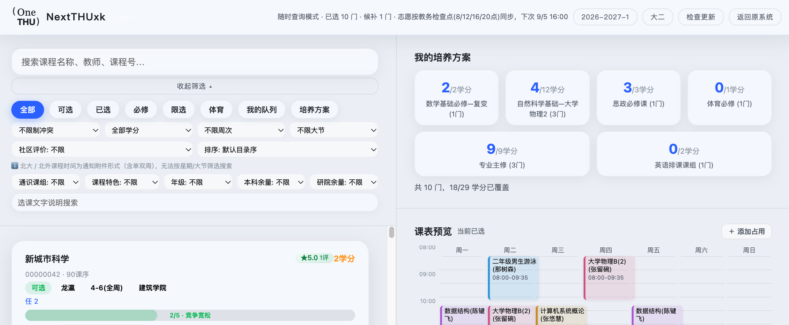

# NextTHUxk — 下一代选课

> 清华本科生选课增强工具。在原选课页面叠加全屏工作台，提供课程搜索、课表预览、暂存管理、AI 排课等功能。

## 安装

> **建议使用方式二（解压加载）**。Chrome / Edge 已收紧外部 .crx 安装策略，直接拖入 .crx 可能被拦截。解压加载在所有浏览器均可正常使用。

> 🚀 校内访问 [git.tsinghua.edu.cn/gjl25/NextTHUxk](https://git.tsinghua.edu.cn/gjl25/NextTHUxk) 下载速度更快。

### 方式一：.crx 拖入安装（Chrome / Arc）

1. 从 [Releases](https://github.com/smartThise/NextTHUxk/releases) 下载 `NextTHUxk.crx`
2. 浏览器打开 `chrome://extensions`，右上角开启「开发者模式」
3. 将 .crx 文件拖入浏览器窗口，确认安装
4. 若提示无法安装，请改用方式二

### 方式二：解压加载（推荐 / 所有浏览器通用）

1. 从 [Releases](https://github.com/smartThise/NextTHUxk/releases) 下载 `NextTHUxk.zip` 并解压
2. 浏览器打开扩展管理页（Chrome: `chrome://extensions`，Edge: `edge://extensions`），开启「开发者模式」
3. 点击「加载已解压的扩展程序」，选择解压后的文件夹

## 使用

进入清华选课网站（zhjwxk.cic.tsinghua.edu.cn 或 zhjw.cic.tsinghua.edu.cn），右下角出现 ✨ 按钮，点击即可打开全屏工作台。



## 功能概览

### 课程浏览与搜索

- 全校课程目录搜索（按课名、课号、教师模糊匹配）
- 按类型快速筛选：**必修 / 限选 / 体育 / 已选 / 我的队列 / 可选**
- 高级筛选：按**学分数**、**周几**、**第几大节**精确过滤
- **时间冲突筛选**：按与当前预览课表是否冲突过滤
- 每门课显示余量、竞争热度、各志愿排队人数

### 中签概率计算（预选阶段）

- 每门课程自动计算**所有合法选法的抽中概率**，红黄绿三色直观展示
- 概率模型基于志愿级联机制：容量按志愿优先级递减分配，结合各志愿报名人数估算中签率
- 课程卡片、暂存区、草稿列表、预览课表均显示概率信息
- 修改课程类型或志愿号后概率实时刷新

### 课余量实时数据（抽签结果阶段）

预选抽签结果出来后，系统自动切换到课余量模式：

- **实时课余量**：从教务系统获取所有课程的容量、剩余座位和排队人数
- **我的队列**：显示个人候补队列，包含队列排名和总排队人数（如「排队第121名 / 共185人」）
- 课程卡片显示余量/排队/排入希望值，替代预选阶段的概率显示
- 课表预览中候补课程显示排队状态，已选课程显示「已选」
- 草稿/暂存在课余量模式下也显示余量队列信息
- 独立的「刷新队列」按钮，一键更新课余量和排队数据

### 时间冲突检测

- 所有课程卡片自动检测与当前预览课表（正选/草稿/暂存）的时间冲突
- 冲突信息直接显示在卡片上（如「⚠ 冲突: 周三3-4节 数据结构」）
- 支持筛选「仅无冲突」或「仅冲突」课程

### 选课 & 退选

- 课程类型选择遵循选课规则：必修课可选必修/限选/任选；限选课可选限选/任选；任选课只能任选；体育课只能体育
- 直接在卡片上选择课程类型和志愿号，点击「选课」提交
- 已选课程可**调整志愿顺序**（▲▼），系统自动校验志愿名额上限
  - 必修 / 限选 / 任选：1 志愿最多 1 门，2 志愿最多 2 门
  - 体育：1 志愿最多 1 门，2 志愿最多 1 门
- 3 志愿不限数量
- 操作后实时刷新选课状态

### 课表预览

- 自动生成已选课程的**周课表**视图（周一至周日 × 第 1-12 大节）
- 时间冲突标红显示
- 可预览暂存区或任意草稿的课表，一键切回正式课表
- 课表单元格显示课程名称和教师姓名
- **可直接在课表上操作**：鼠标悬停显示 ✕ 按钮，点击可退选（已选课）、从暂存移除、从草稿删除
- 暂存/草稿预览课表按概率着色（预选阶段：绿/橙/红；课余量阶段：显示余量/排队人数）

### 暂存课表（草稿）

核心创新功能：在不直接提交选课的前提下，预先编排多套课表方案。

- 将课程「暂存」到草稿区，**最多保存 5 张草稿**
- 暂存区每门课可独立调整课程类型和志愿号，实时显示所有选法的概率
- 已选课程也可一键转化为新的暂存草稿
- 草稿支持**展开查看全部课程列表**，可逐门调整类型/志愿或删除
- 「**提交选课**」：自动退选所有已选课，再按草稿内容一次性选入
- 提交后草稿保留，不会自动删除
- **导出 / 导入**：复制 JSON 分享给同学，对方导入后可直接提交
- 自动检测草稿内课程的时间冲突

### 培养方案检测

- 查看所有培养方案课组及完成进度
- 自动检测：已选课 + 暂存课 + 所有草稿是否覆盖方案要求
- 特殊规则：
  - 体育课互认：任一体育课可满足任意体育方案要求
  - 英语(3) 即「英语进阶读写」，可由「第二外国语」替代
  - 英语(1)(2) 即「英语阅读写作/听说交流(ABC)」，不可由第二外国语替代

### AI 排课

- 填入兼容 OpenAI 格式的 API 地址、模型名称和 Key
- AI 自动读取：当前必修 + 体育课程目录、已选课程、所有暂存草稿、个人偏好
- 生成推荐方案并自动存入暂存草稿区
- 对任选 / 通识课仅给出方向建议，不硬选具体课程

### 自动更新

- 定期检查 GitHub Releases 是否有新版本
- 发现更新时在顶部显示提示横幅
- 也可手动点击「检查更新」

### 学期管理

- 自动从教务系统 URL 检测当前选课学期
- 支持手动切换学期（点击右上角学期标签）
- 切换后自动清空缓存并重新拉取数据

## 数据与隐私

- 选课操作走原系统表单提交，与手动操作完全等价
- 个人数据（草稿、API 配置等）全部存储在浏览器本地
- 扩展代码中不包含任何个人数据
- 课程目录和志愿数据有缓存机制：
  - 课程目录：首次加载后缓存，手动刷新时更新
  - 志愿排队数据：每日 8:00 / 12:00 / 16:00 / 20:00 自动刷新
  - 已选课程：每次打开工作台实时获取

## v1.3.14 衬线简约风 UI

- **视觉重构**：弃用 AI 风紫罗兰渐变，改为**衬线 Serif（宋体/Noto Serif SC）+ 暖灰黑纸感 + 大留白 + 细分割线**的极简排版风
- 去 emoji 化（launch 按钮 ✨ → 「选」字，logo 简化）
- **加载进度反馈**：启动时明确显示「正在读取 / 抓取课程目录（约 300 页，30-40 秒）/ 已读取缓存，加载实时状态」，避免“慢但无感知”
- 缓存命中仍秒开（实时状态单独拉取）

## v1.3.13 回退高速并发

> 按用户决策：回归 v1.3.5 的高速并发抓取。经八轮实测确认教务单一查询深分页在 ~294 页后固定截断，可达数据收敛约 5843 门——不再追那够不着的 6078（服务器计数含不可分页获取的行）

- **速度回退**：课程/志愿/课余量全部回到 5 并发 + 30ms 轻节流（≈30 请求/秒）
- **门槛务实**：课程低于 5800 门才提示不完整；≥5800 即视为达标
- **session 失效熔断**：前天日志显示 session 失效后下课量/余量请求连撞 20+ 次 `Failed to fetch` → 现连续 3 批失败立即停止并提示重新登录
- **修复「已是最新版本 v1.3.1」硬编码** → 改为实时读取 `NX.CUR_VER`（用户报告的显示错误）

## v1.3.12 链式 token 抓取（已回退）

> 用户诊断脚本破案：教务 UI 的翻页函数 `turn(p)` 就是普通表单提交 `page` 字段；但**每次翻页后页面刷新，表单携带服务器下发的新 token**。此前所有版本复用同一个 token 连续提交 300+ 次——Struts 式一次性 token 被复用后，服务器从第 N 次起返回空壳页（N 会漂移：294/181…）。这与 GET/POST、并发/顺序、节流全都无关，也解释了为何 UI 永远正常（每页新 token）

- **链式抓取**：每次翻页从上一响应的 HTML 中提取新 token 再提交，1:1 复刻 UI 行为
- 课程目录与课余量全部链式化；GET 兜底仅在链式完全失败时启用
- 抓全时 Console 明确输出 `catalog COMPLETE: 6078/6078`
- 响应中无新 token 时告警一次（兼作机制判定器）

## v1.3.11 完整表单 POST（被 v1.3.12 取代）

> v1.3.10 实测：GET 请求带院系参数被服务器完全忽略（过滤只认 UI 的表单 POST）；课余量接口表单根本没有院系字段

- **1:1 模拟 UI 翻页**：从查询页自动提取完整表单（token + 全部 20 个字段），翻页用与教务界面完全相同的 POST 请求——过滤条件由此真正生效
- **课程目录**：完整 POST + 85 院系分批（每院系浅分页）；查询条件一律置空，不会误继承界面默认值
- **课余量**：其表单支持按课号过滤 → 按**课号前 2 位分批**（来自课程目录），绕开深翻页限制
- **多层回退**：POST 不可用→GET 全量；院系过滤无效→POST 全量；前缀过滤无效→POST 全量——任何情况不会比上一版更差
- 修复一处致命 URL 拼写（审查捕获：POST 目标地址少 'xk'，会导致整个修复静默失效）

## v1.3.10 院系分批抓取（已被 v1.3.11 取代）

> 五轮实测终结论：教务对**单一查询**的深分页在 ~294 页后返回空壳页（框架完整、数据行为零），与顺序/并发/节流均无关（v1.3.5~1.3.9 逐一排除）——疑似单查询行数/页数上限

- **绕开而非硬闯**：利用查询表单的开课单位（`p_kkdwnm`，85 个院系），把 6000+ 门课拆成 85 个独立浅分页查询，每个查询远够不到深分页上限
- **速度回归**：院系间并发 4、院内顺序；不再逐页爬 304 页大列表
- **自动防御**：先探针校验院系过滤是否生效（Console 输出 `dept-split engaged`），无效自动回退全量顺序抓取并提示
- **诚实计数**：Console 输出「唯一课程数 · 院系条目合计 · 全局分页计数」三项对照（合开课程会跨院系重复计数，属正常）

## v1.3.7 服务器限流适配

> v1.3.6 实测：主抓取冲到 294 页被服务器限流拦截（教务共 304 页），补抓因限流未解除全部失败（5583/6078）

- **请求节流**：所有分页请求经全局节流闸排队（默认 100ms/请求 ≈ 10 req/s），避免触发服务器限流；304 页约 30 秒（仍比旧串行版快 10 倍以上）
- **冷却两轮补抓**：首轮补抓失败后，等待 8 秒（限流窗口解除）再以单并发补一轮
- **失败原因入日志**：Console 直接打印每页失败原因（如 `HTTP 429`），限流/越界/会话失效一眼可辨
- **不完整页面提示**：课程或课余量数据不完整时，页面弹出 ⚠ toast 明确告知缺多少（不再只写 Console）

## v1.3.6 数据完整性修复

> 修复 v1.3.5 在真实环境下的课程抓取不完整问题（实测 6078 门只抓到 4096 门）

- **根因一**：并发抓取时任意一页偶发失败/返回空即误判为末页提前终止 → 现单页失败自动重试 2 次，重试期间暂停铺新页
- **根因二**：首页数据可能被 page=0 结果覆盖丢失 → 改为合并语义（去重保留）
- **总数校验补抓**：从首页分页控件解析「共 N 页（共 M 条记录）」，抓完后自动补齐缺失页；仍缺失则 Console 明细告警，不再静默截断
- 补抓阶段带熔断（连续 5 页失败自动放弃，防止 session 失效时慢速轰炸服务器）
- 分页上限 300 → 320，兼容 0/1 基两种分页语义
- Console 新增 `catalog pager: 共 N 页 / M 条` 与 `catalog total: X courses`，一眼核对抓全没有

## v1.3.5 性能优化

- **加载提速**：课程目录 / 志愿 / 课余量三大分页抓取由串行改为并发（5 路并发窗口），首次加载数据抓取耗时约降至原来的 1/5；排队人数批量查询并发 4
- **内存优化**：课程列表改为渐进渲染（滚动到哪渲染到哪）+ 事件委托，不再一次性创建数千卡片对应的数十万 DOM 节点与闭包；同时移除了对页面所有 iframe 的无效脚本注入
- **卡顿修复**：冲突检测、志愿合并、课程查找全部索引化（原先为 O(n²) 全量扫描）；时间解析结果缓存；搜索输入防抖
- **操作提速**：选课 / 退课 / 排队后的固定等待改为轮询验证（平均省 1 秒以上）；退选单门课不再全量重启
- **存储减半**：静态数据缓存只保留合并后的课程列表，不再存目录副本
- 附带修复：志愿撤下的课程不再残留过期数据；学期切换时不再出现缓存竞态；重复触发加载不再造成双倍请求

## 注意事项

- 仅在清华选课网站域名下生效（zhjwxk / zhjw / webvpn）
- 需要已登录教务系统的浏览器 session
- 体育课的志愿信息独立于其他课程类型，显示规则略有不同

## 文件结构

```
├── manifest.json        # 浏览器扩展配置 (Manifest V3)
├── content.css          # 全部样式
├── content.js           # 入口：HTML 模板 + Shadow DOM + 事件绑定 + 启动流程
├── src/
│   ├── config.js        # 命名空间 NX、常量、工具函数、存储、网络
│   ├── data.js          # 数据抓取与解析（课程目录、志愿、选退课 API）
│   ├── probability.js   # 中签概率计算、志愿格式化
│   ├── state.js         # 暂存/草稿管理、课表解析、冲突检测、选课状态
│   ├── render.js        # 所有渲染函数 + 筛选逻辑
│   ├── ai.js            # AI 搜索 + 智能排课
│   └── update.js        # 版本更新检查
├── popup.html           # 扩展弹出页
├── popup.js             # 弹出页逻辑
└── README.md            # 本文件
```

## License

MIT
